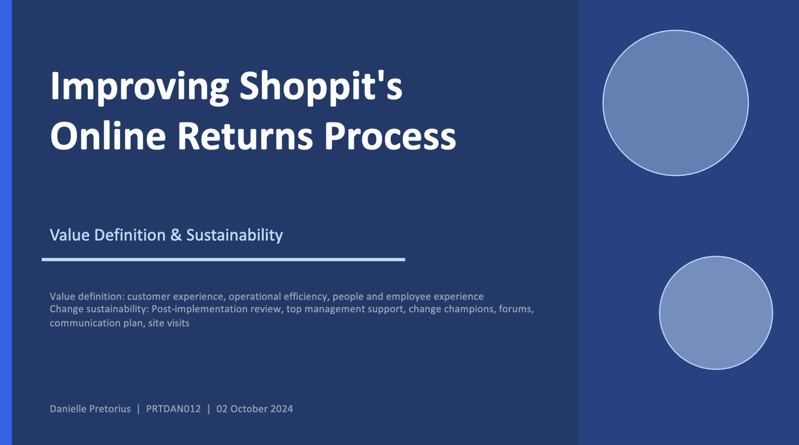

# E-Commerce Returns Process Transformation

## Overview

This project presents a change readiness and implementation framework for a digital returns transformation initiative within an e-commerce environment.

The objective was to evaluate how improvements to the online returns process could create value for customers, employees, and the organisation while ensuring long-term adoption and sustainability.

The analysis focused on operational efficiency, customer experience, employee readiness, organisational feasibility, and change sustainability.

---

## Project Objectives

- Improve customer experience throughout the returns journey
- Increase operational efficiency and reduce process complexity
- Support employee adoption of new systems and workflows
- Assess organisational feasibility and scalability
- Develop mechanisms to sustain change after implementation

---

## Project Deliverables

### Value Realisation Framework

The project evaluated four key value dimensions:

- Customer Experience
- Operational Efficiency
- Employee Experience
- Organisational Feasibility

Each area was assessed using measurable success indicators and implementation considerations.

### Change Sustainability Framework

Recommendations were developed to support long-term adoption, including:

- Post-implementation reviews
- Leadership sponsorship
- Change champions
- Communication planning
- Progress forums
- Site visits and stakeholder feedback

---

## Key Recommendations

### Customer Experience

- Improve transparency throughout the returns journey
- Reduce customer effort during returns processing
- Monitor customer satisfaction and support requests

### Operational Efficiency

- Streamline returns workflows
- Reduce processing errors
- Improve turnaround times
- Support scalable operational growth

### Change Management

- Establish governance and review processes
- Maintain leadership engagement
- Deploy change champions
- Create structured communication and feedback channels

---
## Full Report

📄 [View Full Report](Assets/returns_transformation_report.pdf)

📊 [View Presentation Deck](Assets/returns_transformation_slides.pdf)

---

## Skills Demonstrated

- Change Management
- Business Analysis
- Process Improvement
- Operational Strategy
- Stakeholder Management
- Organisational Development
- Digital Transformation
- Strategic Planning
- Implementation Planning
- Project Sustainability

---

## Project Outcome

Developed a comprehensive implementation and sustainability framework for an e-commerce returns transformation initiative, providing recommendations to improve operational performance, stakeholder adoption, customer experience, and long-term organisational effectiveness.

---

## Author

Danielle Pretorius

Master of Public Health (Health Innovation)
Graduate School of Health Innovation
Tokyo, Japan
